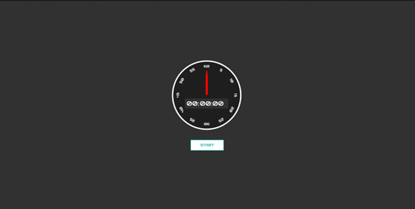
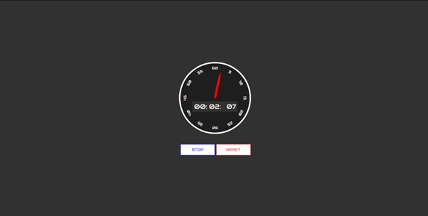

# Stopwatch App

## Description

This is a simple React based stopwatch app that allows the user to keep track of time with a simple and user-friendly stopwatch. Whether they need to time a task, measure an event, or simply want to check the time elapsed, this stopwatch has got them covered.

## Features

- Start: the stopwatch starts the time tracking
- Stop: the stopwach stops the time tracking
- Resume: the stopwatch resumes the time tracking from the last recorded time
- Reset: the stopwatch resets for a restart
- Responsive design to adapt to different screen sizes.

## Live demo

You can try out the Stopwatch App by visiting the [live demo](https://zack1808.github.io/stopwatch/)

## How to run the app

If you want to run the app localy:

#### 1. Clone the repository

- HTTPS: `git clone https://github.com/Zack1808/stopwatch.git`
- SSH: `git clone git@github.com:Zack1808/stopwatch.git`
- GitHub CLI: `gh repo clone Zack1808/stopwatch`

#### 2. Enter the project directory

`cd stopwatch`

#### 3. Allow the app to install the necessary packages (Node.js has to be installed on the device)

`npm install`

#### 4. Start the app

`npm start`

After execution, the localhost server will startup and a browser window will open, previewing the stopwatch app.

## Contribution

Contributions to the Stopwatch project are welcome. If you find any issues or want to add new features, feel free to create a pull request. Make sure to follow the project's coding conventions and provide detailed information about your changes.

## Contact

If you have any questions or suggestions, you can reach me via:

- Mail: jeanpierrenovak23@gmail.com
- My portfolio: [jeanpierrenovak.netlify.app](https://jeanpierrenovak.netlify.app)

---

Happy timing!
